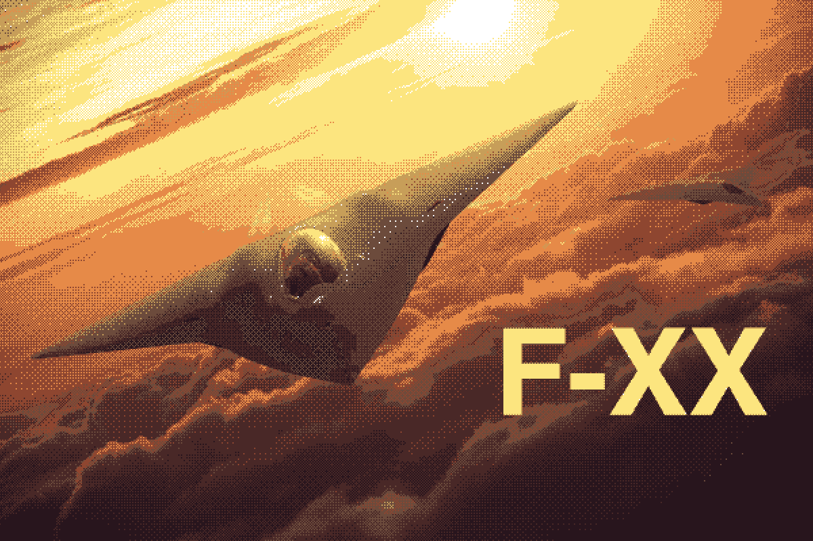
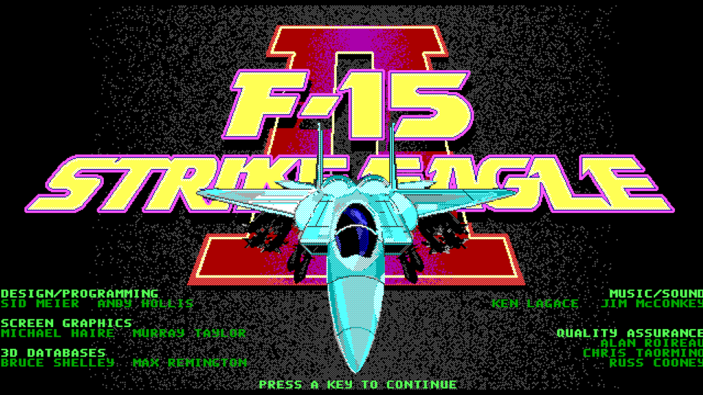

# F-XX (Airborne)

An indie flight simulator gmae without any game engine, just C++ and some libraries.



This project trys to make a little bit modern remake of the
classic [F-15 Strike Eagle II](https://en.wikipedia.org/wiki/F-15_Strike_Eagle_II) and others flight simulators
made by [MicroProse](https://en.wikipedia.org/wiki/MicroProse) back in the 80s.

The magic of those games comes from the fact it is not really a simulator, and it is not really an arcade. It somthing
between just genius like [Sid Meier](https://en.wikipedia.org/wiki/Sid_Meier) can create :).

Check out the [development blog](https://ziv.github.io/airborne/) for updates ot
the [Wiki](https://github.com/ziv/airborne/wiki) for more information.

## The Rules

- Do not use game engine and or LLM
- I have to re-learn CPP and linear algebra (ohh, trigonometry)
- To have fun


## How to

Still in progress, but...

#### Required Dependencies

- C++20 compiler with support for modules (I'm using LLVM with Ninja)
- CMake 3.25 or higher
- Tomtom and Mapbox API tokens for the maps/tiles.

#### Installation and Running

```shell
# make sure to have llvm installed and configured as your default compiler
brew install llvm cmake ninja

# let cmake find the llvm clang compiler
export CC=$(brew --prefix llvm)/bin/clang
export CXX=$(brew --prefix llvm)/bin/clang++

# required environment variables for the map API tokens
export TOMTOM_TOKEN=***
export MAPBOX_TOKEN=***

# creating debug build
cmake -B cmake-build-debug -S . -DCMAKE_BUILD_TYPE=Debug -G Ninja

# compiling and running the game
cmake --build cmake-build-debug && ./cmake-build-debug/airborne
```

---

## Nostalgia Moment

I spent so many hours flying this beast on my XT-16MGhz machine with monochrome CGA resolution screen. I tried to play
it again, it was fun but somthing is missing. No, I don't want another DCS neither an arcade game, I want the same
gameplay I
got from this magic game, so this project has begun.



## TODOs

Leftovers from the ESC refactoring:

- [ ] fog shader
- [ ] complete configuring the terrain streamer
- [ ] performance optimizations: change read only view data to const reference
- [ ] autopilot controller
- [ ] navball widget


## Drafts

```shell
# release
cmake -B cmake-build-release -S . -DCMAKE_BUILD_TYPE=Release -G Ninja

# asan
cmake -S . -B cmake-build-asan -G Ninja -DCMAKE_BUILD_TYPE=Debug -DCMAKE_CXX_FLAGS="-fsanitize=address -g -fno-omit-frame-pointer" -DCMAKE_EXE_LINKER_FLAGS="-fsanitize=address"

# clean builds
cmake --build cmake-build-debug --target clean && cmake --build cmake-build-debug
```
